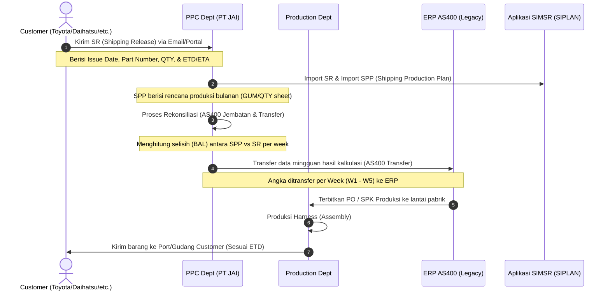

# Analisis Mendalam: Konsep "Week" Produksi, Alur Bisnis SPP/SR, dan Integrasi Sistem AS400 PT JAI

Dokumen ini ditulis dari perspektif **Senior System Analyst** dan **Senior Software Developer** untuk menjelaskan secara terstruktur bagaimana konsep **Week** digunakan dalam file **SPP (Shipping Production Plan)** di PT Jatim Autocomp Indonesia (JAI), hubungannya dengan sistem ERP legacy **AS400**, serta bagaimana memetakan dan mengintegrasikannya ke dalam aplikasi **SIMSR/SIPLAN**.

---

## 1. Alur Kerja Logistik & Produksi PT JAI (SR, SPP, dan AS400)

Untuk menjawab kebingungan mengenai **kapan SR datang, kapan diproses, diproduksi, dan dikirim**, berikut adalah visualisasi alur waktu dan proses bisnisnya:



### Penjelasan Istilah & Timeline:

1. **Kapan SR (Shipping Release) Datang?**
   SR adalah data order aktual dari customer. Biasanya datang secara berkala (misal: mingguan atau bulanan) sebelum bulan berjalan dimulai. 
   * **Issue Date**: Tanggal ketika customer merilis data order tersebut. Dalam satu bulan, customer bisa mengirimkan revisi SR beberapa kali. Issue Date terbaru adalah data yang paling valid.
   
2. **Kapan Barang Diproses & Diproduksi?**
   PPC (Production Planning and Control) JAI akan memproses SR dan menggabungkannya dengan SPP (rencana produksi jangka menengah). 
   * Produksi dijadwalkan berdasarkan **ETD (Estimated Time of Departure)** dikurangi *lead time* produksi & QC (biasanya beberapa hari sebelum kapal berangkat).
   
3. **Kapan Barang Dikirim (ETD vs ETA)?**
   * **ETD (Estimated Time of Departure)**: Tanggal keberangkatan kapal/truk dari pelabuhan/gudang JAI. **Ini adalah patokan utama JAI untuk menentukan batas akhir produksi.**
   * **ETA (Estimated Time of Arrival)**: Tanggal perkiraan barang sampai di gudang customer. JAI tidak terlalu berpatokan pada ETA untuk produksi, karena tanggung jawab pengiriman JAI sering kali berakhir saat barang dimuat ke kapal (FOB - Free On Board).

---

## 2. Mengapa Ada "Production Week" (Master Week) dan Mengapa Berbeda Tiap Customer?

Di PT JAI, **Production Week (Minggu Produksi)** tidak selalu sama dengan minggu kalender biasa (ISO-8601). JAI membagi satu bulan menjadi **4 atau 5 minggu produksi** berdasarkan rentang tanggal pengiriman (ETD).

### Mengapa Pembagian Week Berbeda Tiap Customer?
Setiap customer (Toyota, Daihatsu, SAI, dll.) memiliki:
* Jadwal *shipping* (kapal/truk) yang berbeda.
* Ketentuan pengiriman dari pabrik (misal: Daihatsu minta dikirim setiap hari Selasa, Toyota setiap hari Kamis).
* Siklus *cutoff* sistem ERP mereka sendiri.

Oleh karena itu, **Master Week harus fleksibel per customer**.

Sebagai bukti nyata, mari kita lihat hasil analisis data sheet `WEEK` dari file Excel SPP aktual:

| Customer | Tahun | Bulan | Rentang Tanggal (Range) | Jumlah Week | Karakteristik Sheet WEEK |
| :--- | :--- | :--- | :--- | :---: | :--- |
| **TYC** | 2026 | MAR | `02/MAR ~ 31/MAR` | **4** | Memiliki kolom `Month`, `Range`, `Year`, `Total Weeks`. |
| **YNA** | 2026 | MAR | `02/MAR ~ 31/MAR` | **4** | Format persis TYC, ada kolom tambahan pendukung. |
| **YC** | 2026 | MAR | `02/MAR ~ 31/MAR` | **4** | Menyimpan database historis panjang (2022-2026). |
| **SAI** | 2021 | MAR | *Tidak ada rentang tanggal* | **5** | **Berbeda!** Hanya kolom `Month` & `Total Weeks` per tahun. |

> [!IMPORTANT]
> **Perbedaan Kritis pada SAI:**
> Di file SPP customer **SAI**, sheet `WEEK` tidak memiliki teks rentang tanggal (misal `05/JAN~ 30/JAN`). Mereka hanya mendefinisikan tahun, nama bulan, dan jumlah minggunya (4 atau 5). Ini berarti penentuan tanggal mulai/selesai minggu produksi untuk SAI dihitung menggunakan parameter dinamis sistem.

---

## 3. Cara Kerja "Week" di Excel SPP (AS400 Jembatan & Transfer)

Konsep Week di SPP **bukan** untuk membuat jadwal harian produksi di Excel, melainkan sebagai **pembagi untuk rekonsiliasi data yang ditransfer ke AS400**.

Mari kita bedah formula Excel yang digunakan pada file SPP Customer **TYC**:

### A. Sheet `GUM` (Rencana Produksi Bulanan)
Di sheet ini, jumlah minggu per bulan diambil otomatis menggunakan `VLOOKUP` ke sheet `WEEK`:
```excel
=VLOOKUP(I11, WEEK!A3:D14, 2, 0)
```
*Formula ini mengambil rentang tanggal (kolom B di sheet WEEK) untuk ditampilkan di header rencana produksi.*

### B. Sheet `AS-400 Jembatan`
Jembatan ini membandingkan order mingguan customer (SR) dengan rencana bulanan (SPP).
* Jumlah minggu diambil dengan formula:
  ```excel
  =VLOOKUP(monthName, WEEK!$A$3:$D$14, 4, 0)
  ```
  *(Formula ini menghasilkan angka **4** atau **5** yang menjadi pembagi kolom aktif W1-W5).*
* Menghitung selisih (BAL) antara rencana produksi (SPP) dengan order customer (SR):
  ```excel
  BAL = SPP - Total_SR
  ```
* Mendistribusikan selisih `BAL` tersebut secara merata ke setiap minggu produksi:
  ```excel
  BAL_Per_Week = ROUNDUP((SPP - Total_SR) / Jumlah_Week, 0)
  ```

### C. Sheet `AS-400 Transfer`
Merupakan hasil akhir yang akan di-upload ke sistem ERP AS400.
* Formula mengambil data mingguan dari sheet `AS-400 Jembatan` lalu ditambahkan nilai penyesuaian manual (kolom `VALUE` / `Offset`, misal `-2` atau `0`):
  ```excel
  Transfer_Qty = SR_Qty_Jembatan + VALUE_Offset
  ```
* Nilai sisa pembulatan dihitung ulang menggunakan pembagi `COUNT` kolom aktif (jumlah minggu berjalan):
  ```excel
  BAL_Transfer = (SPP - Total_SR_Transfer) / Jumlah_Week_Aktif
  ```
  Lalu dibulatkan ke atas/bawah dengan formula:
  ```excel
  pembulatan = IF(BAL_Transfer < 0, ROUNDDOWN(BAL_Transfer, 0), ROUNDUP(BAL_Transfer, 0))
  ```

---

## 4. Pemetaan "Week" ke Model Database SIMSR/SIPLAN

Di dalam codebase SIMSR yang sedang dikembangkan, sudah ada model bernama [ProductionWeek](file:///d:/FIKS%20SIPLAN/simsr/app/Models/ProductionWeek.php). Berikut adalah bagaimana kolom-kolom pada sheet `WEEK` di Excel terpetakan ke dalam atribut tabel `production_weeks`:

```
Sheet WEEK (Excel)                   Database Table: production_weeks
┌───────────────────────────┐        ┌──────────────────────────────────────────────────┐
│ A: Month (e.g. "JAN")     ├───────►│ month_name (string, e.g. "JAN")                  │
│ B: Range ("05/JAN~30/JAN")├───────►│ (Diparse menjadi week_start dan end_date)        │
│ C: Year (e.g. 2026)       ├───────►│ year (integer, e.g. 2026)                        │
│ D: Total Weeks (e.g. 4)   ├───────►│ num_weeks (integer, e.g. 4)                      │
└───────────────────────────┘        │ customer_id (NULL jika global, ID jika khusus)   │
                                     │ week_no (1 sampai num_weeks)                     │
                                     │ working_days (array tanggal hari kerja aktif)    │
                                     │ total_working_days (jumlah hari kerja aktif)     │
                                     └──────────────────────────────────────────────────┘
```

### Cara Sistem Memetakan Tanggal ETD ke Week Produksi
Saat PPC meng-import SR, sistem harus tahu part-number dengan tanggal ETD tertentu masuk ke minggu produksi keberapa. Hal ini dihandle oleh fungsi helper di model `ProductionWeek`:

1. **`containsDate($date)`**:
   Mengecek apakah tanggal ETD masuk ke dalam rentang minggu ini dengan membandingkan `ETD >= week_start` minggu ini dan `< week_start` minggu berikutnya.
2. **`findByDate($customerId, $date)`**:
   Mencari record `ProductionWeek` yang sesuai untuk customer tertentu pada tanggal ETD yang diberikan. Jika tidak ada aturan khusus per customer (`customer_id`), sistem akan fallback ke aturan global (`customer_id IS NULL`).

---

## 5. Senior Analyst & Developer Guidance: Skenario Penambahan Master Week

Bagaimana cara terbaik menangani penambahan data minggu produksi? Ada 2 skenario utama:

### Skenario A: Tambah Manual Lewat Aplikasi (Web UI)
1. User memilih Customer, Tahun, Bulan, dan memasukkan tanggal mulai serta jumlah minggu (3, 4, atau 5).
2. **Auto-calculation**: Sistem secara otomatis men-generate baris-baris minggu (`week_no` 1 sampai N) berdasarkan aturan default (Senin sampai Minggu).
3. User dapat menyesuaikan hari libur (*Holiday*) atau hari kerja tambahan (*Extra Working*) pada form UI.
4. Sistem memanggil `upsertWeeks()` di [ProductionWeekService](file:///d:/FIKS%20SIPLAN/simsr/app/Services/Utilities/ProductionWeekService.php) untuk menyimpan ke database.

### Skenario B: Import Lewat File Excel (Bulk Import)
Ini adalah fitur penting bagi PPC agar tidak perlu menginput satu per satu di aplikasi.

#### 1. Desain Template Import Excel
Template import dirancang meniru struktur sheet `WEEK` pada SPP agar user familiar. Contoh format baris data:
* **Month**: `JAN`
* **Range**: `05/JAN ~ 30/JAN`
* **Year**: `2026`
* **Total Weeks**: `4`
* **Holiday Dates**: `16/JAN` (koma sebagai pemisah jika lebih dari satu)
* **Extra Working Dates**: *(kosong)*

#### 2. Logika Validasi & Parsing di Backend (Senior Developer Best Practices)
Proses import dilakukan melalui fungsi `import()` di [ProductionWeekService](file:///d:/FIKS%20SIPLAN/simsr/app/Services/Utilities/ProductionWeekService.php):
* **Pengecekan Header**: Memastikan kolom wajib (`Month`, `Year`, `Total Weeks`) ada di file Excel menggunakan `productionWeekDataRows()`.
* **Regex Parsing untuk Rentang Tanggal**:
  Sistem mencocokkan format teks range tanggal dengan regex berikut untuk memisahkan tanggal mulai dan selesai:
  ```php
  preg_match('/^(\d{1,2})\/([A-Z]{3})\s*~\s*(\d{1,2})\/([A-Z]{3})(?:\s*\((\d+)\))?$/', strtoupper($rangeText), $matches);
  ```
  *Contoh:* Teks `"05/JAN ~ 30/JAN"` akan diparse menjadi start date `2026-01-05` dan end date `2026-01-30`.
* **Pencegahan Duplikasi**: Sebelum menyimpan, sistem mengecek dengan `monthQuery()` apakah minggu produksi untuk customer, tahun, dan bulan tersebut sudah ada di database. Jika sudah ada, sistem akan melempar error duplikasi.
* **Database Transaction**: Pembentukan baris minggu (W1 s/d W5) dibungkus dalam `DB::transaction` agar jika salah satu week gagal dibuat, seluruh data bulan tersebut di-rollback (tidak menggantung).

---

## 6. Rekomendasi Solusi untuk Pemetaan di "Summary per Customer"

Karena pembagian minggu antar customer bisa berbeda (ada yang bulan Maret-nya 4 minggu, ada yang 5 minggu), membuat tabel ringkasan (Summary) yang menggabungkan banyak customer bisa membingungkan.

### Solusi Terbaik yang Direkomendasikan:

1. **Gunakan Pivot Table Dinamis Berdasarkan Filter Customer**
   * Jangan memaksakan struktur kolom W1-W5 yang statis untuk semua customer sekaligus di satu layar tanpa filter.
   * Ketika user memilih **Customer A**, tampilkan jumlah kolom week sesuai konfigurasi Master Week Customer A (misal W1-W4).
   * Ketika user memilih **All Customers**, gunakan standar **Global Production Week** sebagai basis kolom, lalu petakan data transaksi customer ke kolom global tersebut menggunakan helper `ProductionWeek::findByDate($customerId, $etd)`.

2. **Gunakan Patokan Tanggal ETD (Bukan Nomor Minggu Mentah)**
   * Di database transaksi (SR dan SPP), **selalu simpan tanggal ETD spesifik** (bukan hanya menyimpan string `"W1"` atau `"W2"`).
   * Nomor minggu (`week_no`) harus selalu dihitung secara dinamis via kode dengan mencocokkan tanggal ETD ke rentang master week yang aktif. 
   * Dengan cara ini, jika konfigurasi Master Week diubah atau di-import ulang, pemetaan data transaksi akan ikut ter-update otomatis secara akurat tanpa merusak integritas database.
